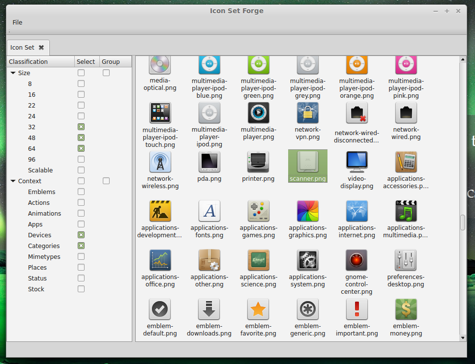

# What Is Icon Set Forge?
  
*Icon Set Forge* is (or rather strives to become) an application for managing, 
maintaining, editing, or simply observing icon sets in a convenient manner. It 
is aimed to work on all major desktop operating systems, including GNU+Linux 
distributions, OS X, and Windows.

## A Simple Use Case:

### Load and Filter Icons
- Open an icon set (with all it's cryptically-nested subfolders) as if it were a 
single file.
- See the icons contained in that icon set in a neatly-arranged user interface
- Apply filters for certain classifications (e.g. category)
- Group icons by certain classifications (e.g. resolution, so you don't see each
icon 5 times in 5 different sizes)

### Screenshot:

### Apply Operations

An icon set loaded as described above can then be edited in a convient way. Some
possible examples include:

- Remove/rename/copy/link an icon
    - operations would be applied according to the grouping specifications set 
    above (e.g. all resolutions of one icon get edited, instead of dealing with
    all of them manually)
- Drop a new icon in vector format or high resolution into the icon set; 
*Icon Set Forge* then generates all necessary files in the correct 
subdirectories
- Open a certain subset of icons in your image manipulator of choice
- Define rules for converting subsets of icons into another form or structure
    - e.g. converting GTK to KDE icon set, iOS to Android, ICQ to Pidgin

## Does It Work with My Particular Icon Set?

The underlying data structures and operations are designed to be flexible and 
extensible. By writing an `AbstractScannerStrategy` implementation, you can 
provide parsers for all kinds of icon sets. No knowledge of the core code is 
necessary, except a basic understanding of the (imho 
[well documented](http://mank319.github.io/Icon-Set-Forge/docs)) model classes.

This is where I especially hope to see fellow developers join the party! 
Implement your icon set type of choice to make *Icon Set Forge* as versatile 
as possible!

## What Has Been Implemented so Far?

- Underlying data structures for working with icons, classifications, and icon 
sets
- A simple implementation of `AbstractScannerStrategy` to load 
[Freedesktop Icon Themes](http://standards.freedesktop.org/icon-theme-spec/icon-theme-spec-latest.html)
- A simple user interface that can display icon sets and classifications
- A mechanism for filtering icons by classification

## From the original author:

# Personal Experience and Feedback

I have not written C++ for quite a while (pre C++11) and never dealt with Qt 
before. So this whole code base is, besides its original aim, also to be 
considered a "learning project" for myself. I tried to explain what I did as 
good as possible and hope that most of my decisions have been somewhat 
reasonable, keeping in mind my limited experience with the aforementioned 
technologies. I am always open for recommendations on both *technical details*
and *(style) conventions*.

# Join Development
Information for developers can be found [here](Development.md).

Every kind of help is appreciated :-)
