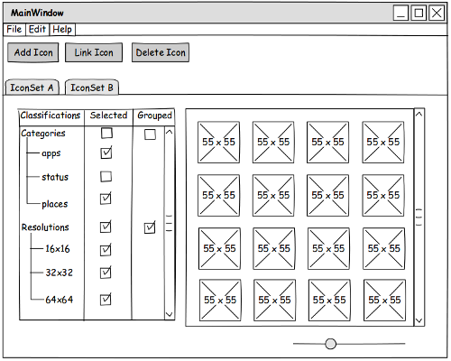

# About
  
*Icon Set Forge* is (or rather strives to become) an application for managing, maintaining, editing or simply observing icon sets in a convenient manner. 

A simple use case could look like this:

- Open an icon set (with all it's cryptically nested subfolders) as if it was a single file.
- See the icons contained in that icon set in a neatly arranged user interface
- Apply filters for certain classifications (e.g. category)
- Group icons by certain classifications (e.g. resolution, so you don't see each icon 5 times in 5 different sizes)

An icon set loaded like described above can then be edited in a convient way:

- Remove/rename/copy/link an icon
    - operations would be applied according to the grouping specifications set above (e.g. all resolutions of one icon get editied, instead of dealing with all of them manually)
- Drop a new icon in vector format or high resolution into the icon set, *Icon Set Forge* then generates all necessary files in the correct subdirectories

Maybe one could even define rules for automating certain operations (e.g. converting GTK to KDE icon set - wouldn't that be great?!).

## Does it work with my particular Icon Set?

The code is designed to be flexible and extensible. By writing own `AbstractScannerStrategy` implementatoins one can write a parser for different kinds of icon sets, that *Icon Set Forge* can then deal with in a completely abstract and transparent manner.

## Personal Experience and Feedback

I have not written C++ for quite a while (pre C++11) and never dealt with Qt before. So this whole code base is, besides its original aim, also to be considered a "learning project" for myself. I tried to explain what I did as good as possible and hope that most of my decisions have been somewhat reasonable, keeping in mind my limited experience with the aforementioned technologies. I am always open for recommendations on both *technical details* and *(style) conventions*.

# Documentation

Different parts of the project are available in documented form:

- A (simplified) [class diagram](./Concept/UML/classes.png) of the most important *model* and *control* compontents

- A [mockup](./Concept/GUI/UI Design.pdf) of how the GUI could look like

- [Code Documentation](./Concept/Documentation/html/index.html)

- ["Brainstorming Documentation"](Concept/Brainstorming/Readme.md)

# Roadmap

- Implement the remaining `model` and `control` classes
    - See also my ["brainstorming documentation"](Concept/Brainstorming/Readme.md) for more details
    - A complete implementation of all advanced functionality is not necessary at this point
    - But the *"functional framework"* must be defined to a degree that avoids subsequent structural changes that would require code refactoring    
- Write an `AbstractScannerStrategy` implementation for parsing [Freedesktop index.theme files](http://standards.freedesktop.org/icon-theme-spec/icon-theme-spec-latest.html)
- Implement the view classes to a degree that it is possible to observe the icon set (filtering + grouping)
- Implement basic operations like copying, linking and renaming of icons (do not forget to implement observer pattern for icon links as described [here](Concept/Brainstorming/Linking Icons.md))
- Implement basic operations on categories?
- Implement advananced operations like inserting icons
- Start implementing a general Parsing strategy that can be extended using a simple language like XML or JSON, so icon set definitions can be easily applied by *"non programmers"*

# Technology Used

## Implementation

*Icon Set Forge* is written in C++ using the C++11 language standard. Using the Qt library (4.8.4) the program should be able to compile, run (and look and feel native) on Linux, OS X and Windows.

## Concept and Design

The screen mockup has been created with the free and open source mockup tool [pencil](http://pencil.evolus.vn/Downloads.html).

The UML class diagram has been created with [PlantUML](http://plantuml.sourceforge.net/) which can be called from the commandline for integration with your favourite buildscript / text editor.

## Documentation

[Doxygen](http://www.stack.nl/~dimitri/doxygen/) is used to generate docs from special documentation comments within the source code. To generate the projects documentation run `doxygen Doxyfile` in the `Concept/Documentation` folder.

# Contributing

**NOTE:** The project is currently in a very early stage where structural stages to base classes may be made. If you want to join development at this point, please ask about possible changes before writing code.

Just leave a comment on what you are about to implement or at least commit to your fork asap (.e.g on a branch with self-explanatory name) so other developers are aware that that particular feature is taken care of by you. Before contributing make sure to have a look at the following guidelines and conventions.

## Guidelines and Code Convention

I will not accept pull requests, that break consistency with the existing code base.
This is to ensure maintainability and readability of the whole project. That being said nobody is perfect and I am generally up for both: Assisting in fixing "irregularities" and finding compromises :-)

### Implementatation Specific Requirements

- Memory management has to be taken care of by implementing strict ownership policies
    - whenever `QOBject` derived classes come into play use parent/child mechanism properly
    - use smart pointers *wisely* where they make sense (technically & semantically)
        - prefer `std::unique_ptr` as it has the strictest form of ownership rule
        - e.g. use as function parameter, to indicate, that the functions "consumes ownership"
        - or use for class members, that must be allocated by `new` for whatever reason to bind them to the classes scope and life time
        - if `std::shared_ptr` is about to be used, check if it is the best options and double check for potential cyclic references!
- Try to enforce [const correctness](http://www.parashift.com/c++-faq/overview-const.html) as strict as possible (yeah I know my code can also be improved regarding that :-)
- Qt containers (`QVector, QList, ...`) are to be used for compatibility with the Qt library
- STL smart pointers are to be used, as they support C++11's move semantics and should not induce any Qt compatibility problems

As mentioned above, the whole concept of smart pointers, move semantics and Qt in general is **new** to me, so there are probably many people out there with better understanding of certain details and C++ in general. If you think you are of such kind, do not hesistate to give me a hint or correct me where necessary.

### Code Style Conventions

- Brackets and indentation as defined by [1TBS](https://en.wikipedia.org/wiki/Indent_style#Variant:_1TBS)
- Tab: 4 spaces (Qt Creator's default setting)
- Inline documentation is to be written and generated with [Doxygen](http://www.stack.nl/~dimitri/doxygen/) 
- Use *Qt style* (`/*! ... \param ...`) for documentation.  
- Do not use `\brief` as `BRIEFAUTO` is active and thus the first line until the first dot is treated as brief description
- Do not use commands that resemble information that *GIT* already takes care of (`\author, \version, \date`)
- Document (Doxygen) every class. At least a one-liner should be possible :-)
- Document (Doxygen) every function, that does not have a 100% self-explanatory name and implementation
- Implementation specific documentation (`// doc...`) is to be applied wherever the code does not explain itself
    - **but first:** check if restructuring (e.g. making 3 functions out of one) would make things clearer
- Do not pollute namespaces by commands like `using namespace std` - especially in header files!
- Lines must not be longer than 80 characters
- **Generally:** It is advised to have a quick look as existing code to have an idea of what I would love to see
- In case you have any more questions you can ask me
- If you find myself violating the above, don't hesitate to tell me! :-)

## Where can I start to help?

Implementing an `AbstractScannerStrategy` for the icon set type of your interest is always a great opportunity to contribute to this project.

If you want to join general development have a look at the roadmap and development that has been going on lately or ask where a helping hand could be of use.